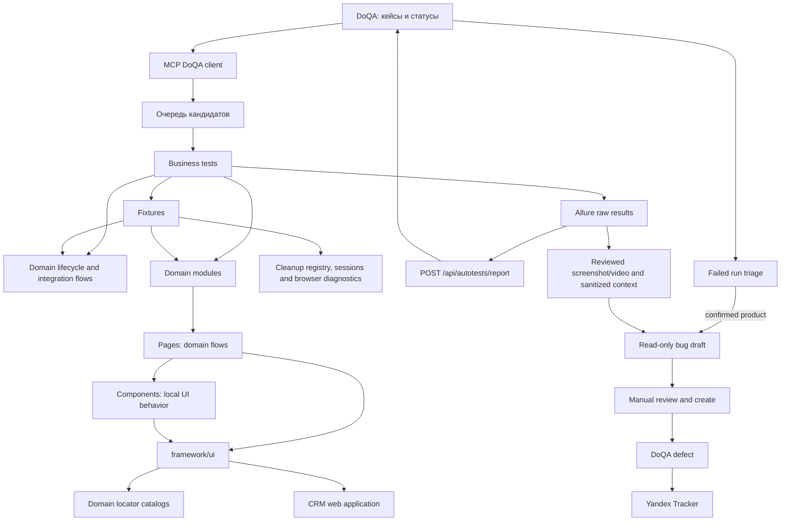

# Архитектура автоматизации CRM

## Назначение

Проект автоматизирует ручные тест-кейсы из DoQA, запускает Playwright-проверки и возвращает результаты в DoQA. Связь ручного кейса с автотестом выполняется через Allure ID, равный ID кейса в DoQA.

## Слои



### `tests/`

Сценарии smoke/regression содержат бизнес-шаги и проверки, но не создают локаторы и не управляют
raw `Page`, BrowserContext, browser events или local storage напрямую. UI доступен только через
публичный API `@modules/*`, а технические сессии и диагностика — через fixtures. Каждый
автоматизированный тест содержит ровно один уникальный числовой
`allure.allureId('<DoQA case id>')`.

### `modules/`

Публичная граница домена. Только этот слой экспортирует страницы и публичные компоненты в тесты
и fixtures. Внутреннюю структуру `pages/` и `components/` можно менять без массового изменения
сценариев.

### `pages/` и `components/`

Page Objects собирают пользовательские и доменные потоки, компоненты владеют локальными
действиями и структурой своего блока. Они наследуют `UiObject` и получают единый API:
`locate`, `actions`, `expectations`. Вызов raw Playwright locator API и диагностического logger
за пределами `framework/ui` запрещён архитектурной проверкой.

### `locators/`

Доменные типизированные контракты устойчивых `data-testid`, доступных имён и динамических
builder-функций. Один UI-домен не должен собирать один и тот же идентификатор в нескольких
компонентах. Каталоги `auth`, `employees`, `navigation`, `kpi`, `kpi-settings` и `common` являются
единственными источниками статических и динамических test ID/CSS/accessible-name контрактов.
Компоненты получают готовые значения из контракта и создают `Locator` через `LocatorFactory`.
Приоритет: `data-testid`, затем role/label, затем документированный устойчивый CSS.

### `framework/ui/`

Единый адаптер над Playwright:

- `LocatorFactory` создаёт локаторы из Page или корневого Locator;
- `UiActions` выполняет действия с диагностическими вложениями;
- `UiExpectations` ждёт и логирует наблюдаемое состояние: видимость, доступность, количество,
  текст и URL;
- `UiObject` предоставляет эти зависимости каждой странице и компоненту.

Изменение логирования, ожиданий или политики локаторов выполняется в одном месте.
Архитектурная проверка не позволяет страницам и компонентам возвращаться к строковым test ID/CSS
и raw `expect()`. Неиспользуемые speculative UI-компоненты не хранятся «на будущее»: общий
компонент добавляется, когда у него появляется реальный потребитель.

### `framework/network/`

`NetworkController` — единая точка для навигации, ожидания API-ответов, сбора запросов и
одноразовых route-моков. Бизнес-тесты не вызывают `page.goto`, `page.route`,
`page.waitForRequest` или `page.waitForResponse` напрямую. Благодаря этому HTTP-диагностика и
политика моков меняются централизованно. Request capture автоматически регистрирует снятие
listener в cleanup registry; ручной `stop()` выполняет раннюю уборку.

### `framework/playwright/`

`ManagedTestSession` даёт дополнительному BrowserContext только разрешённые операции:
навигацию, URL-ожидания, reload и управляемое изменение storage. `TestSessionFactory` создаёт
такие сессии и регистрирует закрытие контекста до возврата управления тесту.
`BrowserDiagnostics` собирает console errors через `ConsoleErrorCapture`; listener всегда
снимается вручную или при fixture teardown.

### `framework/data/`

`TestDataFactory` создаёт уникальные метки и выбирает свободные значения из заданного диапазона.
Сценарии не используют `Date.now`, случайные числа или ручной поиск свободного значения.

### `fixtures/`

Разделены по ответственности: `core-fixtures` владеет пользователями, cleanup, фабрикой данных и
сессиями; `ui-fixtures` создаёт публичные domain objects, network и browser diagnostics;
`domain-fixtures` собирает бизнес-lifecycle. Fixture `cleanup` регистрирует компенсирующие
операции до мутации и выполняет их в LIFO-порядке даже при падении теста. Явная успешная уборка
вызывает `runNow`; если она упала, задача остаётся активной и повторяется в fixture teardown.

`tests/setup/auth.setup.ts` создаёт admin storage state только для авторизованных проектов.
Проверки логина и контроля доступа запускаются отдельными проектами без этой зависимости.

### `tests/support/<domain>/`

Общие API-контракты и доменные lifecycle-сервисы. `AuthSessionLifecycle` инкапсулирует anonymous,
stored, expired и persistent remember-me сессии, включая временные каталоги и гарантированный
cleanup. `KpiSettingsLifecycle` выбирает свободные данные,
регистрирует компенсацию до создания и возвращает `ManagedKpiSettingsAction`. Управляемая сущность
инкапсулирует edit, negative API flow и раннее удаление; если тест падает, fixture выполняет
оставшийся cleanup автоматически.

### `mcp/`

`doqa-client.mjs` работает с API DoQA: ищет кандидатов, читает кейсы, переводит кейс в работу,
загружает отчёты и формирует read-only черновики дефектов элементов прогона. PATCH использует ETag той же версии, которая была прочитана и
проанализирована; при `412 Precondition Failed` клиент повторно читает кейс и не перезаписывает
чужое изменение. Bug-draft flow читает run element, выполняет дедупликацию активных багов по
маркеру `[AUTO][TC-<id>]` и возвращает готовые поля без внешней записи. `server.mjs` предоставляет операции как MCP-инструменты с read/write
аннотациями и структурированным результатом. Секрет отчёта берётся только из окружения, а путь
ограничен доверенным каталогом.

### `scripts/`

`doqa-run.mjs` запускает Playwright, собирает свежий Allure-архив и отправляет его в DoQA.
`allure-report.mjs` оставляет завершённые passed/failed/broken/skipped результаты с одним
уникальным числовым `ALLURE_ID` и их вложения. Пустой архив, некорректный preflight и дубли ID
блокируют публикацию.
После загрузки проверяются `counts.tests`, `progress`, элементы run и соответствие Allure ID
кейсам DoQA. Ненулевой exit code Playwright остаётся ненулевым для CI, но больше не скрывает
результат от DoQA. `bug-drafts.mjs` читает failed/broken Allure results, получает ожидаемый
бизнес-результат из DoQA, исключает stdout/stderr/trace, редактирует чувствительные строки в
error-context и создаёт один `bug.md`, `draft.json`, screenshot/video на Allure ID по результату
последней retry-попытки для ручного оформления.
Визуальные вложения требуют просмотра перед загрузкой.

### `.agents/skills/`

Репозиторий хранит project-scoped Codex skills вместе с кодом. `crm-automate-doqa-case`
маршрутизирует реализацию кейса через locator contracts, modules, fixtures, lifecycle и проверки
DoQA. `check-project-skills.mjs` проверяет frontmatter, UI metadata, ссылки на references и
отсутствие шаблонных TODO при каждом `npm run quality`.

## Статусы

```text
Подлежит автоматизации -> Ревью/в работе -> автотест создан
                                      -> отчёт загружен -> Автоматизирован
```

Ошибки после прогона разделяются на дефекты продукта, проблемы окружения и ошибки самого автотеста.

## Источники истины

- DoQA — описание кейса, его статус и связь с автотестом.
- Код теста — исполняемая реализация проверки.
- Allure — результат конкретного запуска.
- `docs/WORKFLOW.md` — порядок действий агента.
- `docs/LOGGING.md` — требования к диагностике.
