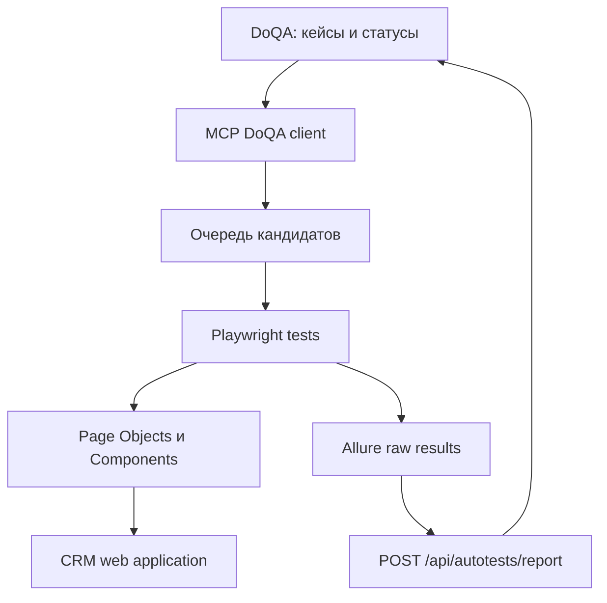

# Архитектура автоматизации CRM

## Назначение

Проект автоматизирует ручные тест-кейсы из DoQA, запускает Playwright-проверки и возвращает результаты в DoQA. Связь ручного кейса с автотестом выполняется через Allure ID, равный ID кейса в DoQA.

## Слои



### `tests/`

Сценарии smoke/regression. Каждый автоматизированный тест должен содержать `allure.allureId('<DoQA case id>')`.

### `pages/` и `components/`

Page Objects описывают страницы, компоненты — переиспользуемые блоки. Селекторы хранятся рядом с объектом, который ими управляет. Предпочтительный селектор — `data-testid`, затем role/label, затем URL или устойчивый CSS.

### `fixtures/`

Подготавливают пользователей и Page Objects поверх `page` текущего Playwright project. `tests/setup/auth.setup.ts` создаёт admin storage state только для авторизованных проектов. Проверки логина и контроля доступа запускаются отдельными проектами без этой зависимости.

### `mcp/`

`doqa-client.mjs` работает с API DoQA: ищет кандидатов, читает кейсы, переводит кейс в работу и
загружает отчёты. PATCH использует ETag той же версии, которая была прочитана и
проанализирована; при `412 Precondition Failed` клиент повторно читает кейс и не перезаписывает
чужое изменение. `server.mjs` предоставляет операции как MCP-инструменты с read/write
аннотациями и структурированным результатом. Секрет отчёта берётся только из окружения, а путь
ограничен доверенным каталогом.

### `scripts/`

`doqa-run.mjs` запускает Playwright, собирает свежий Allure-архив и отправляет его в DoQA.
`allure-report.mjs` оставляет только прошедшие результаты с одним уникальным числовым
`ALLURE_ID` и их вложения. Пустой архив, неуспешный preflight и дубли ID блокируют публикацию.
После загрузки проверяются `counts.tests`, `progress`, элементы run и соответствие Allure ID
кейсам DoQA.

## Статусы

```text
Подлежит автоматизации -> Ревью/в работе -> автотест создан
                                      -> отчёт загружен -> Автоматизирован
```

Ошибки после прогона разделяются на дефекты продукта, проблемы окружения и ошибки самого автотеста.

## Источники истины

- DoQA — описание кейса, его статус и связь с автотестом.
- Код теста — исполняемая реализация проверки.
- Allure — результат конкретного запуска.
- `docs/WORKFLOW.md` — порядок действий агента.
- `docs/LOGGING.md` — требования к диагностике.
