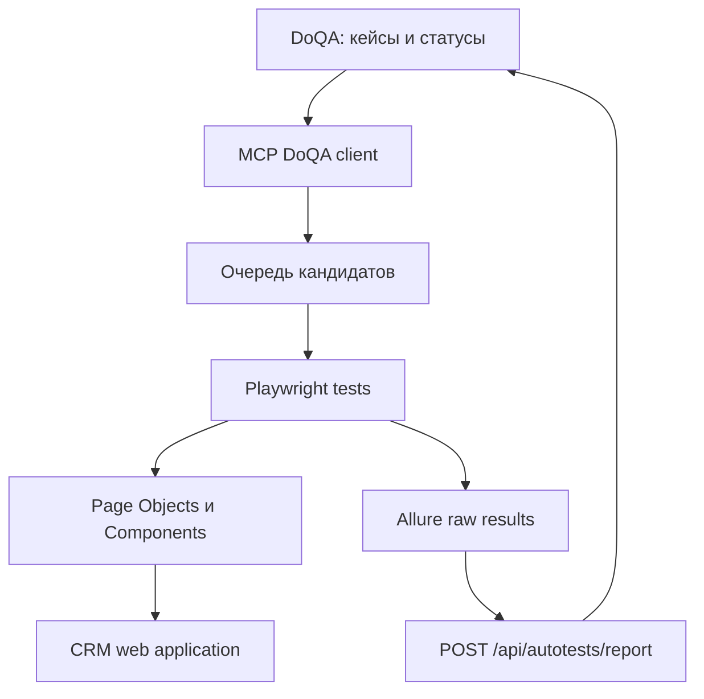

# Архитектура автоматизации CRM

## Назначение

Проект автоматизирует ручные тест-кейсы из DoQA, запускает Playwright-проверки и возвращает результаты в DoQA. Связь ручного кейса с автотестом выполняется через Allure ID, равный ID кейса в DoQA.

## Слои



### `tests/`

Сценарии smoke/regression. Каждый автоматизированный тест должен содержать `allure.allureId('<DoQA case id>')`.

### `pages/` и `components/`

Page Objects описывают страницы, компоненты — переиспользуемые блоки. Селекторы хранятся рядом с объектом, который ими управляет. Предпочтительный селектор — `data-testid`, затем role/label, затем URL или устойчивый CSS.

### `fixtures/`

Создают авторизованные и неавторизованные контексты, подготавливают пользователей и единое состояние тестов.

### `mcp/`

`doqa-client.mjs` работает с API DoQA: ищет кандидатов, читает кейсы, переводит кейс в работу и загружает отчёты. `server.mjs` предоставляет эти операции как MCP-инструменты.

### `scripts/`

`doqa-run.mjs` запускает Playwright, собирает свежий Allure-архив и отправляет его в DoQA. Архив содержит только результаты текущего запуска.

## Статусы

```text
Подлежит автоматизации -> Ревью/в работе -> автотест создан
                                      -> отчёт загружен -> Автоматизирован
```

Ошибки после прогона разделяются на дефекты продукта, проблемы окружения и ошибки самого автотеста.

## Источники истины

- DoQA — описание кейса, его статус и связь с автотестом.
- Код теста — исполняемая реализация проверки.
- Allure — результат конкретного запуска.
- `docs/WORKFLOW.md` — порядок действий агента.
- `docs/LOGGING.md` — требования к диагностике.
